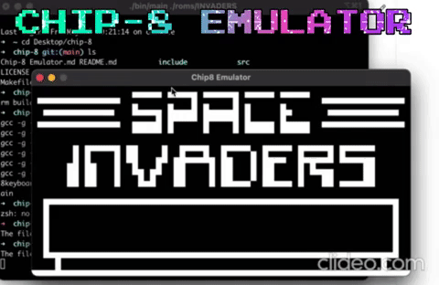

# Chip-8 Emulator

**CHIP-8** is an [interpreted](https://en.wikipedia.org/wiki/Interpreter_(computing)) [programming language](https://en.wikipedia.org/wiki/Programming_language), developed by [Joseph Weisbecker](https://en.wikipedia.org/wiki/Joseph_Weisbecker) CHIP-8 [programs](https://en.wikipedia.org/wiki/Computer_program) are run on a CHIP-8 [virtual machine](https://en.wikipedia.org/wiki/Virtual_machine). It was made to allow [video games](https://en.wikipedia.org/wiki/Video_game) to be more easily programmed for these computers.

## How to run

### for macOS users:

#### clone the repository 

`git clone https://github.com/Harryalways317/Chip-8.git`

#### cd to the repo folder

`cd Chip-8`

by default mac os uses clang compiler so no need to change makefile

#### build the emulator

`make clean`

`make`

#### run the games

The game rom files are included in roms folder

you can choose any game in roms folder just mention the name after `roms/`

`./bin/main roms/INVADERS`

Enjoy the game

#### bugs

1. no bugs as i tested ill update if anything happens

### For Windows Users

#### clone the repository 

`git clone https://github.com/Harryalways317/Chip-8.git`

#### cd to the repo folder

`cd Chip-8`

#### replacing the make file

replace the **makefile** with the file from **windows-helpers/makefile** if you are running MINGW32 compiler

replace the **bin** and **lib** folders with **windows-helpers/bin** and **windows-helpers/lib**

#### Changing the code a lil bit

from file `src/main.c`

1. uncomment line 4 saying

   `//#include <Windows.h>`

2. uncomment line 122 saying

   `Sleep(10)`

3. comment the line 121 saying

   `usleep(1)`

4. uncomment line 128 saying

   `//Beep(15000, 10 * chip8.registers.sound_timer);`

#### build the emulator

`make clean`

`make`

#### run the games

The game rom files are included in roms folder

you can choose any game in roms folder just mention the name after `roms/`

`./bin/main roms/INVADERS`

## Building Blocks

Chip - 8 Emulator consists of 7 main components

1. memory
2. registers
3. stack
4. timers
5. Keyboard / io
6. Screen (Graphics)
7. Opcode table

## Implementation

## Requirements

1. SDL lib
2. gcc or clang installed

i have used the SDL Library becasue it provides low level access to audio, keyboard, mouse, joystick, and graphics hardware and everyone knows SDL library is the basic requirement for games and emulators in c

[SDL Website](https://www.libsdl.org/)

## References:
1. [Cowgods Reference](http://devernay.free.fr/hacks/chip8/C8TECH10.HTM)
2. [Wiki page](https://en.wikipedia.org/wiki/CHIP-8)

